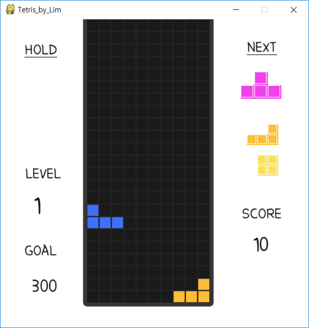

# Minimizing Area by Reinforcement Learning

##### 어떤 사람이 여러 다른 크기의 직사각형들을 A4 용지를 잘라 만들고자 한다. 

##핵심질문: 이때 어떻게 자르는 것이 A4 용지를 가장 적게 사용하는 방법일까?


이 문제를 강화학습을 이용하여 풀고자 합니다.

사용하고자 하는 API는 

1. Tensorflow
2. OpenAI gym
3. pygame
4. numpy

정도가 되겠습니다. 

코딩하는 환경은

1. Windows 7 or 10
2. Anaconda 3
3. python 3.6 


### 현재 상태

강화학습을 하기 위한 환경을 구축하고자 합니다. Tetris에 사용된 코드를 벤치마킹 하는 것이 환경구축에 도움이 될 수 있을 것 같아 Tetris를 연구하는 중입니다. 

### 향후 예정 사항

1. Environment 구축 (알고리즘, 평가방식 등)
2. Environment가 구축이 되면, 강화학습 알고리즘을 작성.

# Tetris by LIm
tetris made with pygame


### Tetris같은 Tetris

idea source : [tetris official](http://www.tetrisfriends.com)


## 실행방법

```
python tetris.py
```
or
```
python tetris.py
```


## How to control

| Command      | Key         |
|--------------|-------------|
| Move left    | Left arrow  |
| Move right   | Right arrow |
| Rotate right | Up arrow    |
| Soft drop    | Down arrow  |
| Hard drop    | Space       |
| Hold block   | Left shift  |
| Pause game   | Esc         |
| Down faster  | press Down  |


# Base Function

1. 7개의 블럭이 랜덤으로 나와 회전키를 누르면 각자의 모양으로 회전한다.
2. 블럭이 좌우키를 누르면 좌우 한 칸씩 움직이고 블럭이 일정시간마다 한 칸씩 떨어진다.
3. 바닥에 내려가면 쌓인다.

# to Add more Function

0. game_over & hard_drop(space-bar)

 board의 가장 윗 두 줄에 닿으면, 즉   
  board의 0번째나 1번째 줄에 블럭이 존재하면
  Game_over이다.
1. start screen  
start를 누르는 게 아니라 아무 키를 누르면 시작된다.
구글의 tetris, start 이미지와 내가 만들어놓은 mino를 입체감 있게 배치했다.
start screen의 활기한 노래가 나온다.


2. design
어떻게 tetris 처럼 더 만들 수 있을까?

  * add color (tetris official color)
   - Tetrimino 7개 의 색상을 맞게 구현

  * tetris board에 border draw로 격자 추가
  * 테두리에 border와 circle로 부드러운 테두리 생성
  * sound 추가
  * tetris의 아기자기하면서도 각져있는 이미지를 위해
  - [font source](http://blog.naver.com/park-yeji/220585210916)
   에서 아이럽우유라는 폰트를 적용




3. functional additional things

     a. hold<Br/>
        - 블럭이 shift를 누르면 홀드할 수 있게 구현<Br/><Br/>
     b. next<Br/>
        - 다음 3번째 블럭까지 오른쪽 상단에 출력되도록 구현<Br/><Br/>
     c. score-goal-level<Br/>
        - drop, hard_drop, delete line (depends on number of lines)<Br/>
        - 각각에 따른 score가 반영되고, goal 설정에 따라 score가 goal을 넘을시 레벨이 1개씩 오름<Br/><Br/>
     d. level-speed system<Br/>
        - level을 올릴때마다 게임의 loop 속도를 올리는 방법으로 난이도를 조절<Br/><Br/>
     e. pause<Br/>
        - esc를 누르면 게임이 멈추고 다시 esc를 누르기 전까지는 pause loop가 돌아감<Br/><Br/>
     f. press down key<Br/>
        - down 방향키를 누르고 있으면 블럭이 빠르게 내려감<Br/>
        - 누르는 동안 게임 속도를 작은 값의 constance 으로 설정<Br/><Br/>
